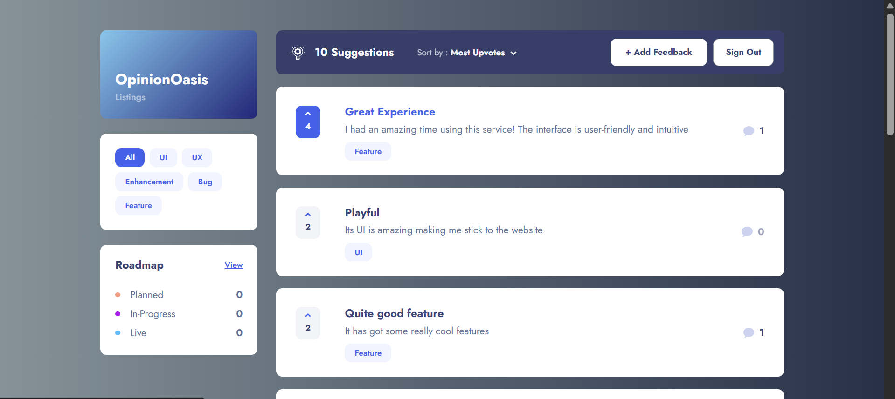
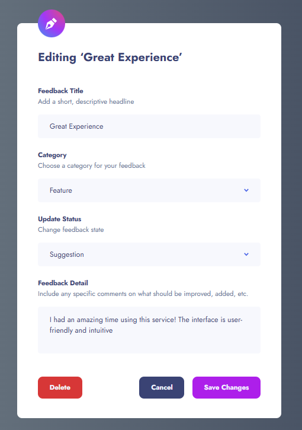
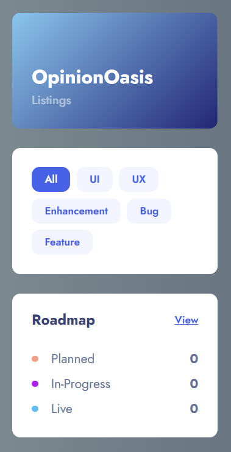
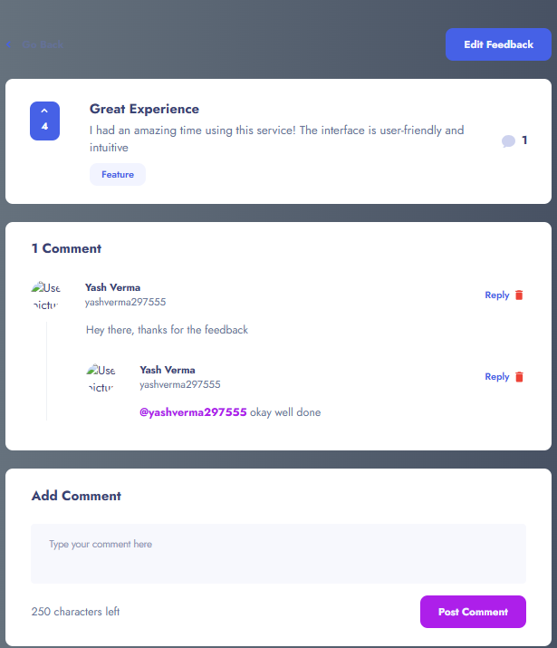
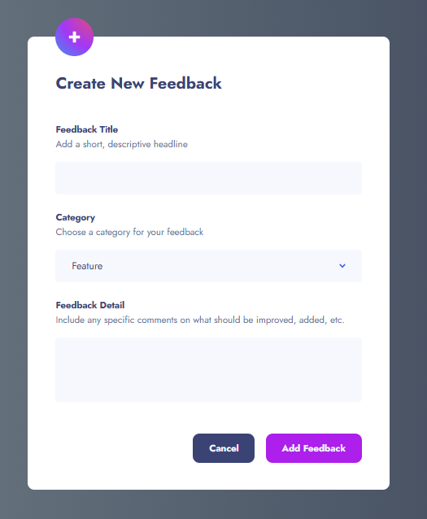
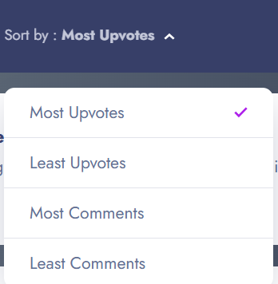

# OpinionOasis

OpinionOasis is a modern, full-stack Product Feedback application built with React, Redux Toolkit, Firebase, and Styled Components. It enables users to submit, upvote, and discuss product feedback, featuring Google authentication, real-time updates, category filtering, and a visually appealing, responsive UI.

---

## ✨ Features

- **User Authentication:** Sign in with Google using Firebase Auth.
- **Feedback Management:** Add, edit, and view detailed feedback items.
- **Upvoting:** Users can upvote feedback to signal importance.
- **Commenting System:** Nested comments and replies for rich discussions.
- **Category Filtering:** Filter feedback by categories like Feature, Bug, UI, UX, and more.
- **Sorting:** Sort feedback by upvotes or comment count.
- **Roadmap View:** Visualize feedback status (Planned, In-Progress, Live).
- **Responsive Design:** Optimized for desktop, tablet, and mobile.
- **Persistent State:** Uses Redux Persist for state management across sessions.
- **Styled Components:** Consistent, themeable, and maintainable styles.

---


<h2 align="center">📸 Project Screenshots</h2>

<p align="center">
  
  <br/><br/>
  
  <br/><br/>
    
      <br/><br/>
    
      <br/><br/>
    
      <br/><br/>
    
      <br/><br/>
</p>


---

## 🚀 Demo (LIVE)

You can deploy this project using [Firebase Hosting](https://opinionoasisnsut.firebaseapp.com/) or any static hosting provider.
*Add your live demo link here if available.*

---

## 🏗️ Complete Project Structure

```plaintext
├── public/
│   ├── index.html
│   └── mockServiceWorker.js
├── src/
│   ├── assets/
│   ├── components/
│   ├── config/
│   │   └── firebase.ts
│   ├── pages/
│   │   ├── AddFeedback.tsx
│   │   ├── EditFeedback.tsx
│   │   ├── FeedbackDetail.tsx
│   │   ├── Home.tsx
│   │   ├── index.tsx
│   │   └── Roadmap.tsx
│   ├── redux/
│   │   ├── actions/
│   │   │   ├── feedback.ts
│   │   │   └── user.tsx
│   │   ├── slices/
│   │   │   ├── commentSlice.tsx
│   │   │   ├── feedbackSlice.tsx
│   │   │   ├── filterSlice.tsx
│   │   │   ├── modalSlice.tsx
│   │   │   └── userSlice.tsx
│   │   └── store.tsx
│   ├── routes/
│   │   └── index.tsx
│   ├── services/
│   │   ├── comment.ts
│   │   └── feedback.ts
│   ├── styles/
│   │   ├── CommonButton.ts
│   │   ├── CommonInput.ts
│   │   ├── GlobalStyle.ts
│   │   ├── Input.ts
│   │   ├── LogButton.ts
│   │   └── Textbox.ts
│   ├── types/
│   │   ├── request.ts
│   │   └── user.ts
│   ├── utils/
│   ├── App.tsx
│   ├── index.html
│   ├── main.tsx
│   └── vite-env.d.ts
├── .eslintrc.cjs
├── .firebaserc
├── .gitignore
├── firebase.json
├── index.html
├── package.json
├── package-lock.json
└── README.md
```


---

## 🧑‍💻 Getting Started

### 1. Clone the repository

```bash
git clone https://github.com/yourusername/opinionoasis.git
cd opinionoasis
cd src

```


### 2. Install dependencies

```bash
npm install
```


### 3. Configure Firebase

- Go to `src/config/firebase.ts` and update the `firebaseConfig` object with your Firebase project credentials.


### 4. Start the development server

```bash
npm run dev
```

The app will be available at [http://localhost:5173](http://localhost:5173) (or your configured port).

---

## 🛠️ Tech Stack

- **Frontend:** React, TypeScript, Styled Components
- **State Management:** Redux Toolkit, Redux Persist
- **Backend:** Firebase (Firestore, Auth)
- **Routing:** React Router v6
- **Authentication:** Google OAuth via Firebase
- **Icons:** FontAwesome

---

## 🔐 Authentication

- Uses Firebase Auth for Google sign-in.
- User state is managed via Redux and persisted across sessions.

---

## 📦 Main Features Explained

### Feedback System

- **Add Feedback:** Authenticated users can submit new feedback.
- **Edit Feedback:** Authors can edit their own feedback.
- **Upvotes:** Users can upvote feedback. Upvote state is stored per user.
- **Comments \& Replies:** Each feedback supports threaded comments and replies.


### Filtering \& Sorting

- **Categories:** Filter feedback by predefined categories.
- **Sort Options:** Sort by upvotes or comment count, ascending or descending.


### Roadmap

- **Status Tracking:** Feedback items are categorized as Planned, In-Progress, or Live.
- **Roadmap Page:** Visual summary of all feedback status.


### UI/UX

- **Responsive Sidebar:** Collapsible on mobile, always visible on desktop.
- **Styled Components:** Custom, themeable components for a consistent look.
- **Accessibility:** Semantic HTML and ARIA best practices.

---

## 🧩 Folder Highlights

| Folder/File | Purpose |
| :-- | :-- |
| `src/assets` | Static images and assets |
| `src/components` | All UI and logic components |
| `src/pages` | Page-level components for routing |
| `src/redux` | Redux Toolkit slices, actions, and store |
| `src/services` | Firestore CRUD and business logic |
| `src/types` | TypeScript types and enums |
| `src/utils` | Helpers, constants, and custom hooks |
| `src/styles` | Global and component-level styled components |
| `public` | Static files, HTML, and service worker |


---

## 📝 Customization

- **Styling:** Edit styles in the `styles/` directory or within styled components.
- **Categories \& Status:** Update `src/utils/constants` to add/remove categories or status options.
- **Firebase:** Swap in your own Firebase project for authentication and data storage.

---


## 🙏 Acknowledgements

- [Firebase](https://firebase.google.com/)
- [React](https://react.dev/)
- [Redux Toolkit](https://redux-toolkit.js.org/)
- [Styled Components](https://styled-components.com/)
- [MSW](https://mswjs.io/)
- [FontAwesome](https://fontawesome.com/)

---

## 👤 Author

Made with ❤️ by Yash

---

## 💡 Contributing

Contributions, issues, and feature requests are welcome!
Feel free to check the [issues page](https://github.com/yourusername/opinionoasis/issues).

---

## 📬 Contact

For questions or support, open an issue or contact [yashverma297555@gmail.com](mailto:yashverma297555@gmail.com).


---

**Happy building! 🚀**

<div style="text-align: center">⁂</div>
